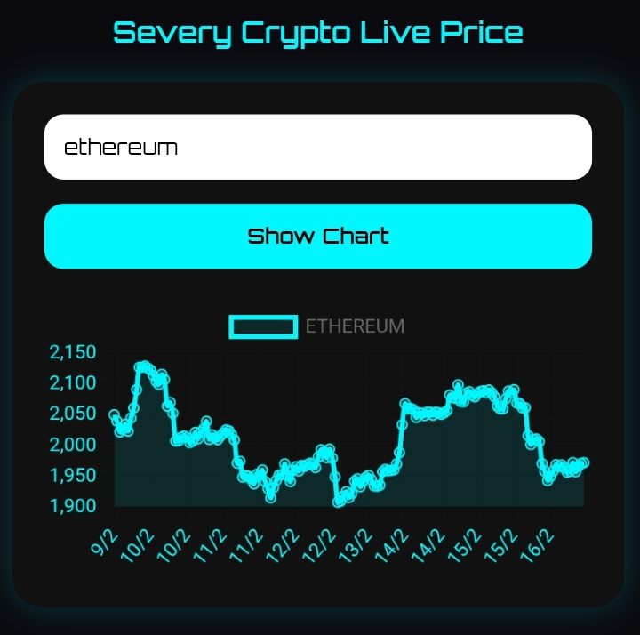

# 📈 Severy Crypto Live Price

Severy Crypto Live Price is a mobile-first cryptocurrency tracking application built with Node.js and Express.

This project provides real-time market data from the CoinGecko API and displays a dynamic 7-day interactive price chart with a modern cyber-style interface.

Designed specifically for mobile viewing, this app focuses on simplicity, speed, and visual clarity.

---

## ✨ Features

- 📊 7-Day Live Price Chart
- ⚡ Real-time market data (CoinGecko API)
- 📱 Mobile-first responsive layout
- 🌌 Neon cyber-themed UI
- 🔌 Simple REST API endpoint

---

## 📸 Proof of Work



---

Trac Address : trac1hce98zla6agj5tqmrg0z8nuxnecemxp6x04deedejqma97ry3mysr5x6p4

---

## 🔗 API Endpoint

GET /api/price/:coin
### Example:
/api/price/bitcoin
Returns 7-day historical price data in USD.

---

## 🛠 Tech Stack

- Node.js
- Express.js
- Axios
- Chart.js
- CoinGecko Public API

---

## 🚀 Installation Guide

Follow these steps to run the project locally:

### 1️⃣ Clone the repository

git clone https://github.com/severy09/severy-crypto-live-price.git
cd severy-crypto-live-price
### 2️⃣ Install dependencies

npm install
### 3️⃣ Start the server

npm start
### 4️⃣ Open in browser

http://localhost:3000
---

## 📦 Project Structure

```
severy-crypto-live-price/
  public/
    index.html
  server.js
  package.json
  README.md
```
---

## 🧠 How It Works

The server fetches cryptocurrency market chart data from CoinGecko’s API and exposes it through a custom REST endpoint.

The frontend then renders the data dynamically using Chart.js to generate a responsive line chart optimized for mobile devices.

---

## 👨‍💻 Author

Built by severy09

### 👋 Note from BitcoinReevolution

Nice work on the live price agent 👏

We’re building a neutral, censorship-resistant discovery layer for Intercom  
(no central marketplace, no bans — just announce + discover p2p).

Spec: https://github.com/digitalgenesis-bitmap/digitalgenesis-bitmap

Would love to see your agent discoverable via this layer.
